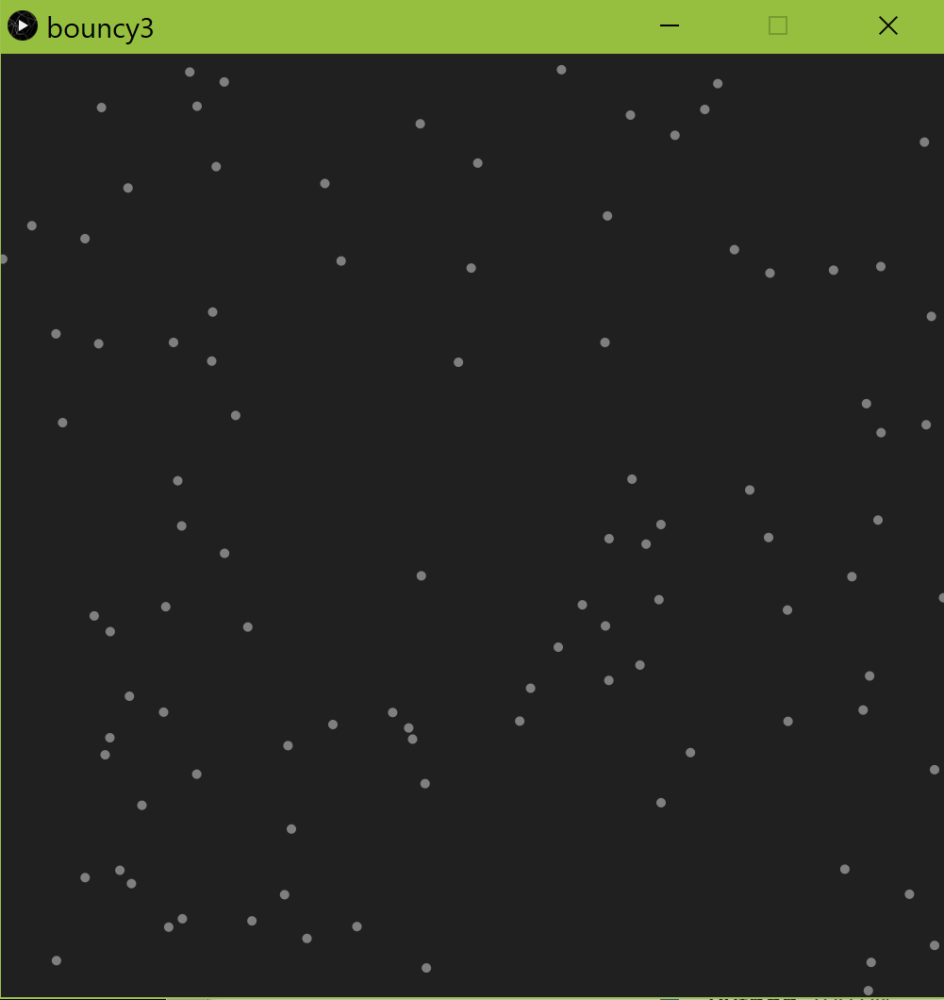

# ml_models

test out here:

https://davidpomarede.github.io/ml_models/synth_circles.html

Testing out different model structures with Python and Processing.

 "Un calcul éclatant pareil aux computations de mesure du temps par sectionnement et computation des intervalles." ~ Quelqu'un Quiqonque

  
 
 for use with Processing (MIT) 3.5.4.
  
